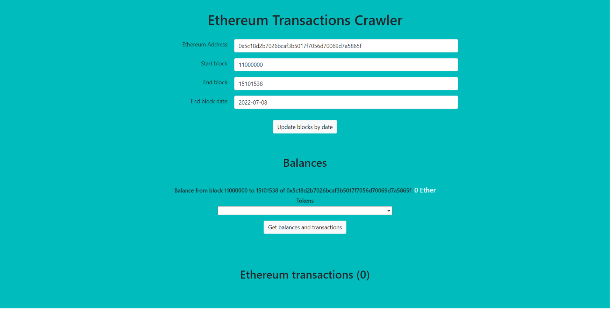
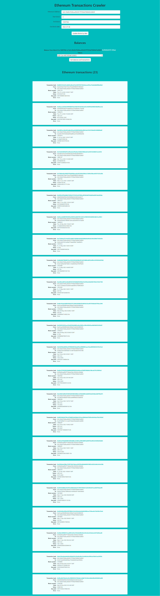
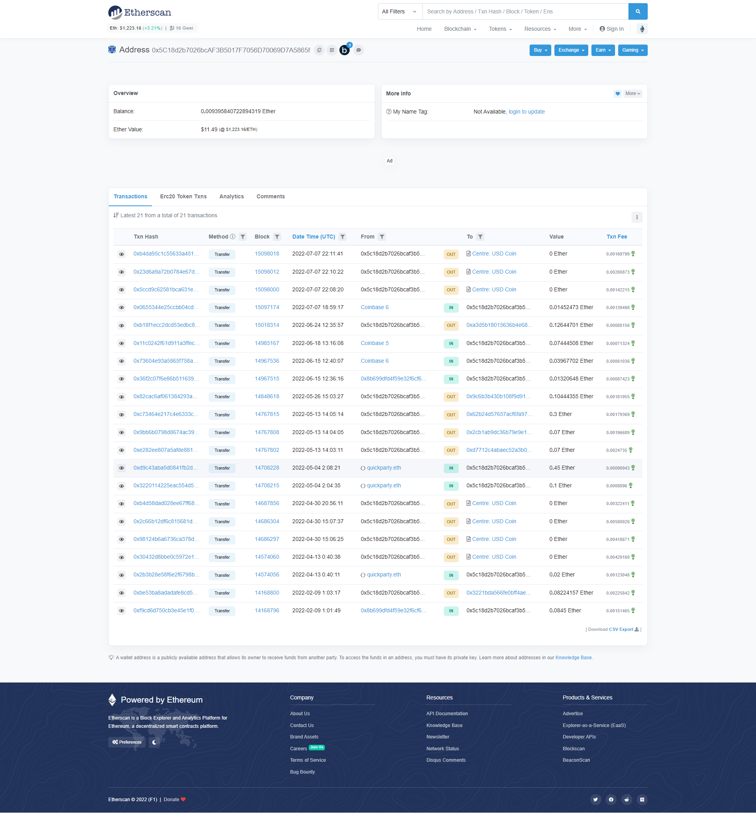
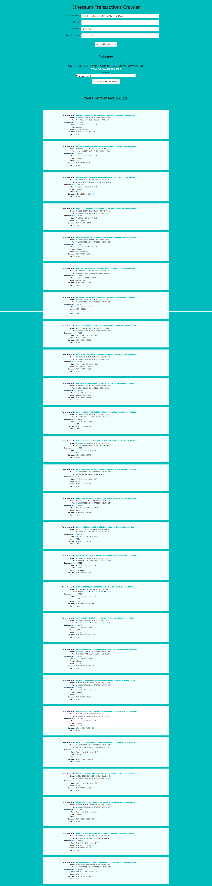
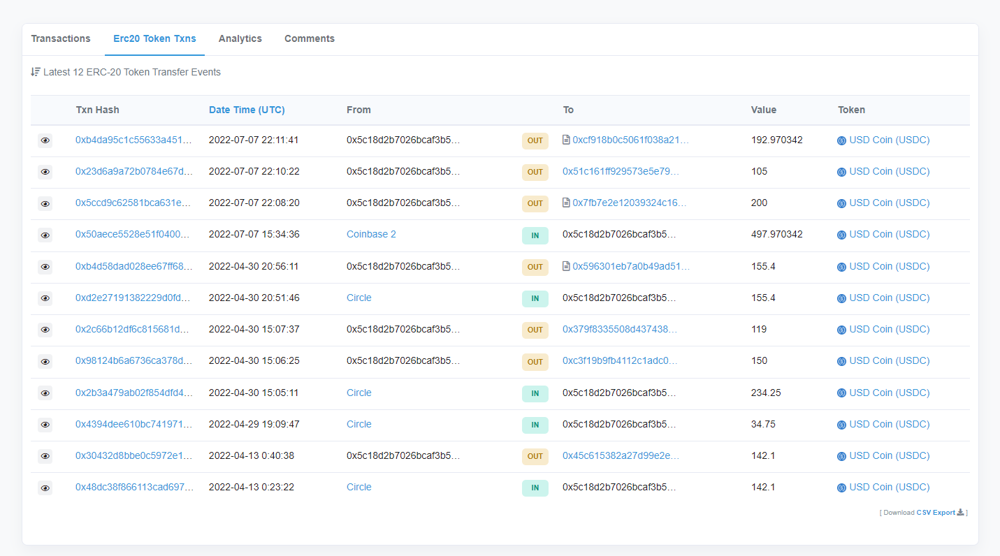

# Ethereum Transactions Crawler

I used [etherscan](https://etherscan.io/) which is a blockchain explorer to avoid indexing by each block.
It would be a struggle to write this application only with an Ethereum node.
Pagination from etherscan is not implemented in this version so there is a 10000 limit per transaction data.

This project was bootstrapped with [Create React App](https://github.com/facebook/create-react-app).

To run the project we can simply run these 2 commands in the project directory:
```
npm install
npm start
```

All available scripts commands:
`npm start`
`npm test`
`npm run build`

Later open [http://localhost:3000](http://localhost:3000) to view it in your browser.

If an application was built successfully we should see a page like this:


## Getting Started

Application will query etherscan for transactions between `Start block` and `End block`,
later balances for eth and tokens will be calculated based on that data.
So we can calculate the balances in specific block ranges.

When page will load the first API call will make is to get last block number from etherscan so `0` should change to something near `15101234`.

If we want to calculate balance from the beginning we can just simply input `0` as `Start block`.

Button `Update blocks by date` will convert data from `YYYY-MM-DD` format from `End block date` input to timestamp,
later block height will be updated based on corresponding timestamp.

Button `Get balances and transactions` will get transaction data for given constraints like `Ethereum Address`, `Start block` and `End block`.
Based on that data balances of Eth and tokens will be calculated.

## Example usage

TODO: write example usage





## TODO

TODO:
- Test BN library, I don't know why but for this wallet 0x9f4a83475ef57f70c1a7754c3b381479626900ea I found that some tokens are not calculated properly. Check tokenValueAsString again.

TODO for future:
- Add paging in while loop for etherscan API call to exceed 10000 row limit.
- Add other Token standards (Erc721 for uniswap v3 and others)
- Improve error handling and add some messages in UI.
